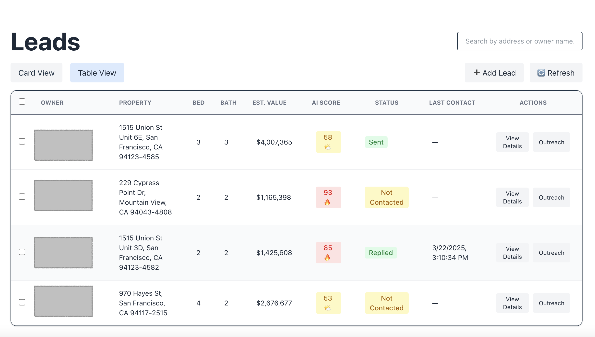
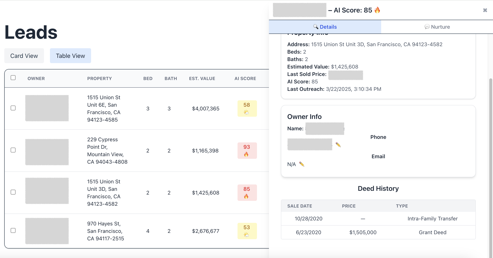
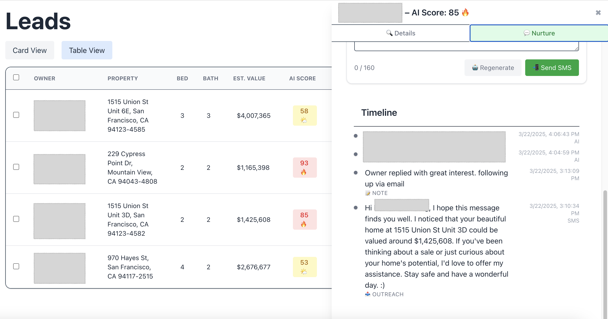

# 🧠 LydFlow – AI-Powered Real Estate Lead Manager

LydFlow is a smarter way for agents and brokers to manage property leads.  
With real-time AI scoring, SMS outreach powered by GPT-4, and a clean timeline view — you’ll always know who to contact and when.

---

## ✨ Key Features

- 📊 **AI Lead Scoring**  
  Prioritizes leads based on property history, owner engagement, and contactability.

- 💬 **Smart SMS Outreach**  
  Generate personalized, professional texts in one click using GPT-4 and send directly via Twilio.

- 🕓 **Unified Timeline**  
  View messages, notes, and status updates in a single chronological feed per lead.

- ✅ **Lead Limits by Tier**  
  Flexible plans: Agent, Broker, Enterprise – with clear limits on leads, messages, and team size.

- 🛠️ **Admin Controls & Feature Flags**  
  Centralized limit and access control based on user role or tier.

---

## 🖼️ Screenshots

> *Click to enlarge*

| Lead Dashboard | Lead Details | Outreach & Timeline |
|----------------|--------------|----------------------|
|  |  |  |

---

## 🧰 Tech Stack

- **Frontend:** React, Tailwind CSS  
- **Backend:** Node.js, Express, MongoDB  
- **AI:** OpenAI GPT-4 for message generation  
- **SMS:** Twilio API  
- **Data Enrichment:** BatchData property lookup (alpha)  
- **Auth & Access Control:** Tier-based via middleware and centralized limits

---

## 🚧 Current Stage

We’re in **private alpha** with a small group of early testers.  
If you’re a real estate agent or team leader curious about smarter lead flows:

👉 [Join the Waitlist](mailto:tech@coconests.llc)

---

## 🧑‍💻 About the Builder

Hi, I’m a real estate investor & tech builder working at the intersection of property, data, and automation.

Feel free to reach out or connect!

📧 info@coconests.llc
🌐 [LinkedIn](https://www.linkedin.com/in/huanhuan-wang-29267917)

---
